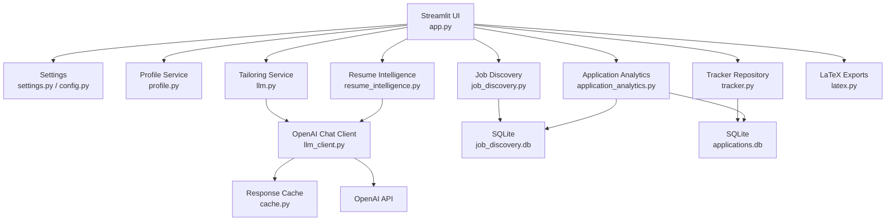

# Architecture

The Job Application Co-Pilot is a local Streamlit application with a service-oriented Python package under `src/job_copilot`.

## Boundaries

- `app.py` owns Streamlit rendering and user interaction.
- `settings.py` validates runtime configuration and resolves environment overrides.
- `llm_client.py` owns OpenAI request execution, retries, JSON-mode fallback, and response caching.
- `llm.py` and `resume_intelligence.py` own prompt-specific normalization and public generation APIs.
- `tracker.py` owns application persistence through `TrackerRepository` while preserving function wrappers for compatibility.
- `job_discovery.py` owns public-feed discovery, ranking, deduplication, saved searches, alerts, and export helpers.
- `application_analytics.py` owns metrics, breakdowns, chart data, and insights.
- `profile.py` owns profile migration, enrichment, validation, and serialization.

## Data Stores

- `data/applications.db`: application tracker records.
- `data/job_discovery.db`: discovered jobs, saved searches, and job alerts.
- `data/cache/llm_responses.json`: optional response cache keyed by prompt, model, and temperature.

## Reliability

- OpenAI requests use configurable retries and graceful JSON-mode fallback.
- Job source failures are logged and surfaced without stopping the whole discovery refresh.
- SQLite tables include indexes for tracker history, job ranking, status filters, dates, and analytics.
- Profile migration preserves factual data and leaves missing information empty.
